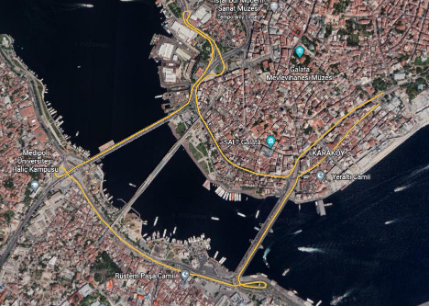
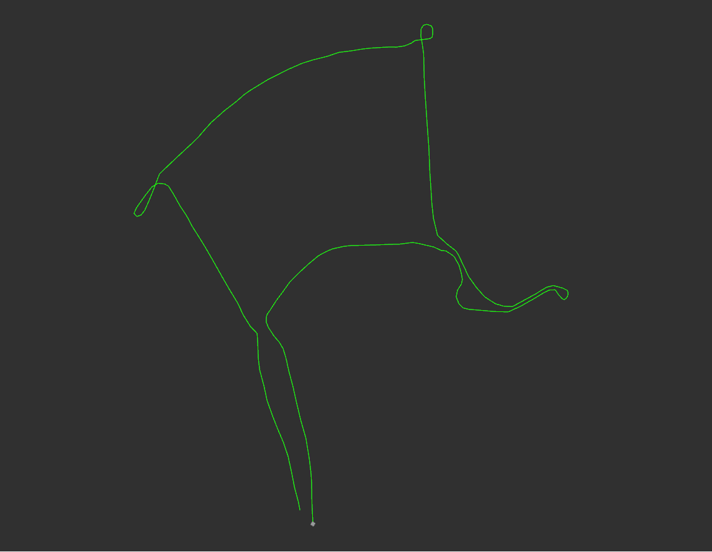

# OGCtoLocal
Transform Open Geospatial Consortium (OGC) standardized coordinates in KML file to local coordinates and publish as path_msg on ROS2.
## Requirements
- [ROS2 Foxy](https://docs.ros.org/en/foxy/Installation/Ubuntu-Install-Debians.html)
- [libkml](https://pointclouds.org/downloads/](https://github.com/google/libkml)
- [GeographicLib](https://geographiclib.sourceforge.io/C++/doc/install.html)
## Build
```
cd ${workspace}/src
git clone https://github.com/yvzksgl/OGCtoLocal.git
cd $[workspace}
colcon build
source install/setup.bash
```
## Launch
```
ros2 launch kml_parser kml_parser.launch.py
```
## Result

Visualization of route in OGC standard coordinate system.

Rviz2 output of localized coordinate system with respect to start point as origin.
